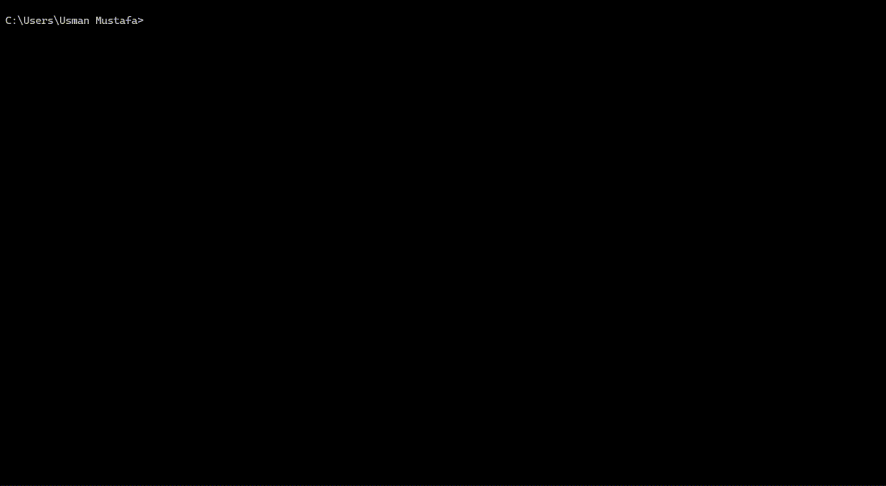

# code-stick

> **Plug in a USB. Get an offline AI coding agent on any laptop.**
> One stick. Six targets — **Windows (x64 + ARM64), macOS (Apple Silicon + Intel), Linux (x64 + ARM64)**. Zero install on the host.

[](https://www.npmjs.com/package/code-stick)
[](./LICENSE)
[](https://nodejs.org)



```bash
npx code-stick install
```

## Why

You want an AI coding agent that works on:

- **Airgapped or restricted machines** — banks, defense, hospitals, lab VMs.
- **Shared / borrowed laptops** — internships, school computers, client sites.
- **Spotty wifi** — flights, trains, cafes, conferences.
- **Privacy-sensitive code** — closed-source clients, NDAs, personal projects.

Cloud agents won't work. Installing Ollama + a 5 GB model on every machine you touch won't either. code-stick is the in-between: install once on a USB, then run the agent from the stick on whatever laptop is in front of you. Host stays clean.

Under the hood it's [opencode](https://opencode.ai) (terminal coding agent) talking to [Ollama](https://ollama.com) (local model runner), both pre-built for every target, both serving from the USB on `127.0.0.1:11434`. Quit the agent, the Ollama process dies, the host has no residue.

## Install + first launch

```bash
npx code-stick install            # auto-detects USB; pick a model interactively
```

Plug the stick into any supported machine, double-click the launcher
for that OS:

- `start-windows.bat`
- `start-mac.command`
- `start-linux.sh`

opencode runs in the terminal talking to a USB-local Ollama on
`127.0.0.1:11434`. Quitting opencode kills the Ollama process. Nothing is
left behind on the host.

## Models

The recommended default is **Qwen2.5-Coder 7B** — fits a 32 GB stick, runs
on 8 GB RAM, best all-rounder for code. Other curated options scale up
to 32B for serious refactors on larger sticks.

| Model               | Size    | Stick / RAM    | Best for                          |
| ------------------- | ------- | -------------- | --------------------------------- |
| Qwen2.5-Coder 7B ⭐  | ~4.7 GB | 32 GB / 8 GB   | All-rounder for coding            |
| Qwen2.5-Coder 14B   | ~9.0 GB | 64 GB / 16 GB  | Stronger reasoning + multi-file   |
| Qwen2.5-Coder 32B   | ~20 GB  | 128 GB / 32 GB | Top-tier OSS coder, near-frontier |
| Phi-3 Mini 3.8B     | ~2.2 GB | 32 GB / 4 GB   | Lightweight, low-spec hardware    |

Full curated list, BYO Ollama tag instructions, and per-model context
windows: [`docs/MODELS.md`](docs/MODELS.md).

> ⚠ **USB 2.0 sticks are unusable for models >7B.** ~30 MB/s read means
> a 20 GB model takes ~11 minutes just to warm up. Use **USB 3.0 or
> better** for anything bigger than 7B.

> ⚠ **First-prompt latency on large models** can be 30–90 s — Ollama is
> mmap'ing the weights off the USB. Subsequent prompts are fast once the
> OS page-caches the blob.

> ⚠ **macOS first-launch:** Gatekeeper will block the unsigned launcher
> (notarization is on the roadmap). Right-click `start-mac.command` →
> Open → Open. Details: [`docs/TROUBLESHOOTING.md`](docs/TROUBLESHOOTING.md#macos-gatekeeper-blocks-the-launcher).

## Commands

| Command                            | Description                                                                |
| ---------------------------------- | -------------------------------------------------------------------------- |
| `code-stick install`               | Set up code-stick on a USB                                                 |
| `code-stick start`                 | Start opencode + Ollama from a USB                                         |
| `code-stick status`                | Show what's installed                                                      |
| `code-stick doctor`                | Live audit (port + Ollama + opencode + model store)                        |
| `code-stick update`                | Refresh launcher scripts and manifest timestamp                            |
| `code-stick upgrade-engine`        | Re-download Ollama + opencode without nuking the model store               |
| `code-stick add-model [id]`        | Pull another model onto the stick                                          |
| `code-stick remove-model [id]`     | Remove a model from the stick                                              |
| `code-stick add-targets [list]`    | Add OS targets to a stick installed with `--targets` (restore portability) |
| `code-stick uninstall`             | Wipe code-stick from the stick                                             |

Full flag reference, install modes (Fast vs Direct), and `--targets`
trimming: [`docs/COMMANDS.md`](docs/COMMANDS.md).

## Requirements

- **USB free space:** 8+ GB only with `--targets host` (see
  [`docs/STORAGE.md`](docs/STORAGE.md)); 16+ GB for full portability with
  small models; 32+ GB (recommended default + Qwen 7B); 64+ GB (medium), 128+
  GB (large).
- **USB format:** exFAT or NTFS. FAT32's 4 GB file limit blocks models
  above ~4 GB; the installer detects FAT32 and bails clearly.
- **Install machine:** Node 20+. Target machines need **nothing**.
- **Target laptop RAM:** rule of thumb is model size × 1.2. See the
  per-model column in [`docs/MODELS.md`](docs/MODELS.md).

## Status

v0.2.1 — opencode v1.x, per-model `num_ctx` bake. Full install flow on
Windows (x64 + ARM64), macOS, Linux (x64 + ARM64) — tested manually per
target. Surface Pro / Snapdragon X laptops boot natively (ARM64) with
x64-via-Prism fallback if only the x64 target is staged. Docker-based
Linux smoke test in CI. No telemetry, no background HTTP. Bug reports
are local-only and redacted before write.

Known gaps: macOS not yet notarized, no Windows/macOS CI runners.

File an issue or open a PR if you hit anything:
[github.com/MuhammadUsmanGM/code-stick/issues](https://github.com/MuhammadUsmanGM/code-stick/issues).

## Documentation

- [`docs/STORAGE.md`](docs/STORAGE.md) — USB sizing, default 6-target download (~5–7 GB binaries), 8 GB + `--targets host`
- [`docs/TROUBLESHOOTING.md`](docs/TROUBLESHOOTING.md) — hallucinations, Gatekeeper, MAX_PATH, port conflicts, bug reports
- [`docs/MODELS.md`](docs/MODELS.md) — full model catalog, BYO Ollama tags, quantization, context windows
- [`docs/COMMANDS.md`](docs/COMMANDS.md) — every subcommand and flag, Fast vs Direct, `--targets`
- [`docs/ARCHITECTURE.md`](docs/ARCHITECTURE.md) — stick layout, runtime behavior, process isolation
- [`docs/SECURITY.md`](docs/SECURITY.md) — trust model, threat boundaries
- [`docs/TRUST.md`](docs/TRUST.md) — supply-chain provenance

## Development

```bash
npm install
npm run typecheck     # tsc --noEmit
npm test              # vitest run (unit + launcher snapshot tests)
npm run build         # tsup → dist/cli.js
npm run smoke:docker  # full end-to-end install + launch in Linux Docker
```

## License

MIT — Muhammad Usman ([github.com/MuhammadUsmanGM](https://github.com/MuhammadUsmanGM))
